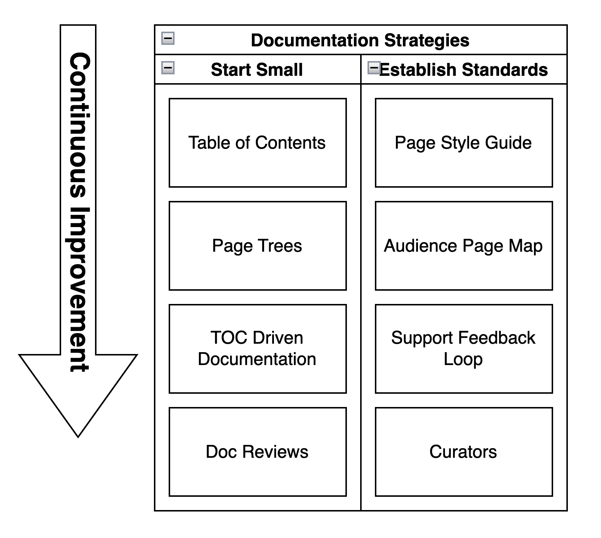

!!! info "Comment"

    This is a documentation strategy that I have written twice now at different companies. In each instance, the underlying technology was Confluence. But the overall design could be applied to any system. Where possible, I have tried to adapt but it is a work in progress.

## What?

Intentional Documentation is the application of engineering principles to documentation. These pages present the idea along with proposed adoption strategies.

This documentation was originally written while leveraging the Confluence Wiki to generate documentation. While instructions around use of Confluence are here and work well, the overall direction of organizing documentation remains consistent.

## Why?

Speed up understanding of material, speed up onboarding, build a single source of truth, build client trust, reduce support cost, and most of all, provide repetition and consistency.

## How?

For a top-down approach, establish an audience page map and page style guide and drive adoption with support feedback loops, and curators - all covered here.

For a bottom-up approach, add Table of Contents (TOC) macros, PageTree macros, and begin to apply TOC Driven Documentation and get reviews on your docs.

Do both! :slight_smile: 

## Getting started

{ style="width:70%" }

## Common Challenges

### Documentation is always out of date!

This is a symptom of poorly maintained documentation often without a Support Feedback Loop or Documentation Review practices.

### Self Documenting Code

Self documenting code is a misnomer. There are all sorts of gotchas in programming which do not self-document. Overall architecture of code does not self document. Deployment does not self-document.