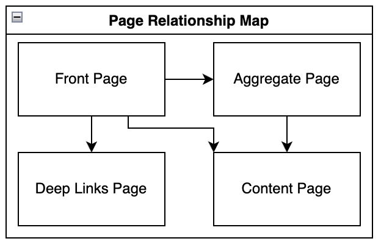
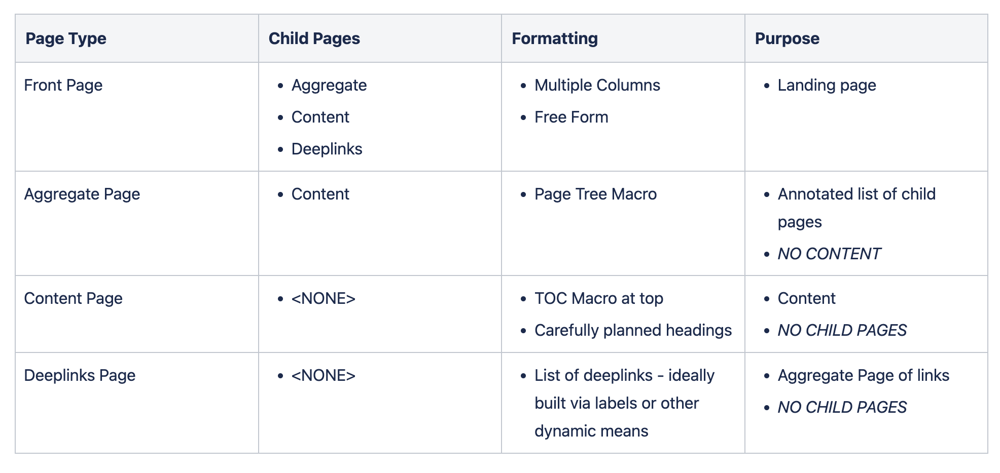

## What

A Page Style Guide is much like a Code Style Guide. It is a set of proposed standards that we try to get everyone to follow which, when used together, help make the documentation have a common form and flow.

## Why

When reading documentation, consistency is the key. Establishing a Page Style Guide helps speed up documentation creation by authors on your system as well as enabling users to more quickly explore and digest the information.

## Page Types

Page types define the different types of pages that are part of the page style guide and what they should look like.

### Front Page Type

The front page is a freeform landing page for a concept or topic with a lot of child pages

#### Page Style Benefits

* convey information for multiple audiences at a glance
* provide fast contact information relating to the documents
* encourage freeform and flexible landing pages

#### Requirements

* “info” macro at the top with a brief description of the topic
* excerpt macro for use by dynamically annotated aggregate pages
* provide overall direction for users to consume child pages

#### Strategies

A good front page is more around presenting good introductions to your topic with sufficient organization. Things to include:

* Introduction at the top - what is this page all about? An “info” macro is nice.
* Use multiple columns
* Include who the primary contacts are about the page/product/support-model/etc
* Include a diagram! Diagrams help convey topics and are attention-grabbing
* Include a page tree partway down that shows all the child pages
* Include persona-based Deep Link pages or just sections to help different types of personas who will view your page find the information they most care about quickly

### Aggregate Page Type

The aggregate page type is a page containing child pages. It should not contain *any* content.

#### Page Style Benefits

* dynamically annotated page tree with optional localized (child-only) search
* ensure author thinks carefully about overall pages architecture
* keeping content away helps ensure single-source-of-truth for content
* keeping content away avoids mixed purposes

#### Requirements

* Excerpt macro at the top
* PageTree macro
* NO CONTENT

#### Formatting

When adding the PageTree macro, consider setting the following minimum options:

* Root Page set to “@self” - this ensures old child pages of the current page will be displayed
* Include Excerpts in Page Tree checked - this provides for the dynamically annotated page trees we want to see!
* Show Expand/Collapse Links checked - this adds a convenient way to quickly see the full depth of the page tree

If this page tree has a lot of child page content or is deeply nested, consider also setting:

* Include Search Box above Page Tree checked - this will put a search box above the page tree that searches only within the page tree (Note: The search box has no heading so you may want to add something like “Search in the Pages:”)

<!--TODO CONSIDER ADDING A CONFLUENCE HOW-TO SECTION
#### Sample in View Mode

In this sample screenshot, I have clicked the “Expand all” link so I could see the full page tree. Notice that the annotations continue even for the nested pages. (Also notice I took this screenshot prior to writing an excerpt for the Aggregate Page Type page…)
-->

### Content Page Type

The Content Page Type is the page that holds the most information. It is the leaf-node containing all of your documentation. Aggregate Pages, Front Pages, and Deep Links Pages are all part of the organizational control to support making information in Content Pages easy to find.

#### Content Page Style Benefits

* A TOC macro for your page with minimal heading structure in place
* encourage authors to think of their pages in the broader sense when writing an explanation for what it is
* provide an annotated entry for aggregate pages to draw upon
* encourage authors to think about how to structure headings so that the TOC makes for intuitive reading
* opportunity for authors to pre-structure their doc for future editors to expand on

#### Requirements
The content page is the meat of the documentation. This is where all the diagrams, paragraphs and sources of truth lie. The content page must have:

* A table of contents (TOC) macro at the top
* Excerpt Macro within first H1 heading
* Carefully planned headings
* NO CHILD PAGES

#### Formatting

* The TOC doesn’t have a heading by default so add one in paragraph bold that reads “Table of Contents”
* Make sure to use an excerpt macro just under the first level 1 heading with a brief single sentence synopsis of the purpose of the page. This is to support the Aggregate Page Type usage of a dynamically annotated page tree.

### Deep Links Page Type

A Deep Links Page is an Aggregate Page with links but not Child Pages.

The Deep Links Page is a necessity born out of the intertwined relationship of information. To ensure a consistency across documentation, only one style of presentation can be used. This necessarily means that other ways of finding the information are not used. Deep Links Pages help compensate.

#### Page Style Benefits

* able to provide links based on aggregate topics not already present in document structure
* be intentional about deep links by topic without confusing readers about location (eg: we don’t want to have two different ways of interpreting where to put documentation - just use a deeplinks page to overcome the limits of aggregation)

#### Requirements

* Excerpt macro at the top
* Hand-curated list of links
* or use a macro that relies on labels
* NO CONTENT
* NO CHILD PAGES

#### Strategies

Deep Links pages are a necessity because it is not possible to build out the perfect documentation every time. There will always be sets of pages that go well together in different contexts. The best solution is to adopt a consistent organization and then use deep links pages to meet the needs for document aggregation that the organization doesn’t end up supporting.

You can always build up deep links pages by hand. While they do run the risk of getting out of date, you have to start somewhere.

#### Examples

Some common examples of deep links page uses.

* Support pages - often aggregate information together that clients may need but the information is scattered throughout the development pages

## Text Styles

Text styles help explain when to use bold or italic fonts, paragraphs, bulleted lists, and more. I recommend keeping this simple lest your style guide become so hard to follow that people ignore it.

## Page Relationships

Establish page types and how they relate to one another.

{ style="width: 50%"}

### Relationship Details
<!-- TODO: Conver table picture to text HTML table -->

