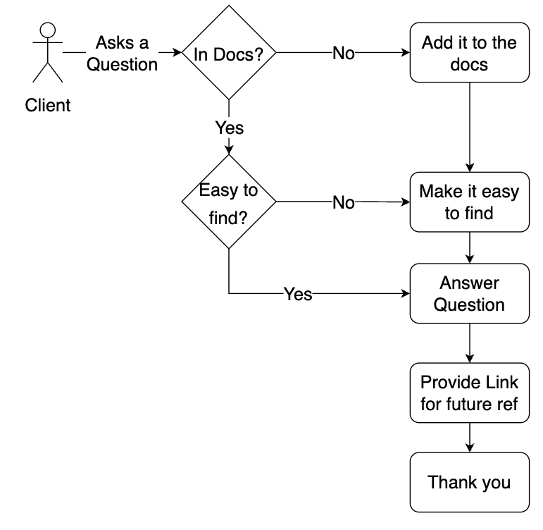

## What

This is a strategy to adopt to help improve support documentation over time. Even (especially) internal engineering docs have support pages. A Support Feedback Loop means updating your docs to have answers to all questions you get asked.

### Backstory

I supported a platform with 200 users for a couple years. After refactoring the documentation to align with my intentional documentation design, I iterated on my support documents. Whenever someone asked me a question, I followed the process outlined here.

## Why

Following a support feedback loop helps to build a knowledge base over time which has numerous benefits both for your team and your users:

* builds a consistent curated set of answers to questions
* answers can be leveraged by support staff both new and experienced
* builds trust in your team and your product
* reduced support time as users begin to use your documentation instead of asking you over and over

## How

A support feedback loop is illustrated in this diagram - the goal is to build a knowledge base.

{ style="width:55%"}

**When receiving a question:**

1. Check to see if the answer is in the documentation
      1. If it *IS NOT* present, then add the answer to the documentation
      2. If it *IS* present, check if it was easy to find:
            1. If it *IS NOT* easy to find, then make it easier to find
            2. If it *IS* easy to find, do not change the docs
2. Provide an answer with:
      1. Gracious professionalism - thank you
      2. A brief or summarized answer to the question
      3. A link to the documentation
      4. If their question led you to update your documentation, make sure to thank them for that

## Etiquette

When providing feedback, it’s critical not to be condescending. The tone of the message should be thankful and transparent. This helps build trust.