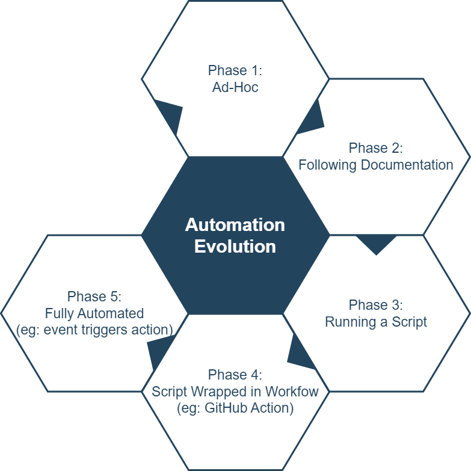

!!! note ""
    Automation is a journey, not a destination. Using a phased approach like this can help to delineate stages within the journey. If published internally, such a phase set can also help clients to understand the state of systems. The phases can be enhanced by adopting best practices or standards to go along with each phase.

{ style="width:70%"}

## Phase 1: Ad-Hoc

* The process or action is done manually by an engineer
* The information is often siloed away in the mind of an engineer or other documentation anti-patterns (e.g.: videos, slide decks)

## Phase 2: Following Documentation

* The process or action is documented
* An engineer is following documentation and executing the steps manually

!!! note "Documentation Quality Caveat"
    The quality of the documentation is not part of these phases.

## Phase 3: Running a Script

* The process or action has been built into a script
* An engineer is following documentation
* The engineer is running the script manually

## Phase 4: Script is Wrapped in Manual Trigger

* The process or action has been wrapped around a workflow dispatch trigger
* An engineer is following documentation
* The engineer manually triggers the workflow

## Phase 5: Fully Automated

* The process or action is triggered automatically based on events
