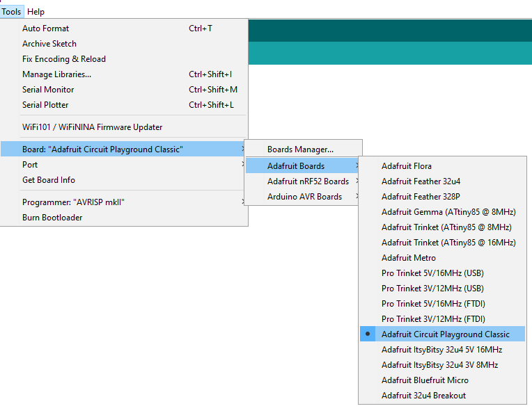

# Adafruit Circuit Playground

We bought two [Circuit Playground Classic](https://www.adafruit.com/product/3000) boards from [Adafruit](https://www.adafruit.com/). One for me and one for Edward.

## Setup

* download and install the [Arduino IDE](https://www.arduino.cc/en/software)
* follow [instructions](https://learn.adafruit.com/adafruit-arduino-ide-setup/arduino-1-dot-6-x-ide) for installng custom boards
* open the Arduino IDE and select the `Adafruit Circuit Playground Classic`

## CircuitPython?

Looks like Circuit Playground Classic sadly does not work with Python. :(

* Trying the Mu editor https://codewith.mu/en/download
