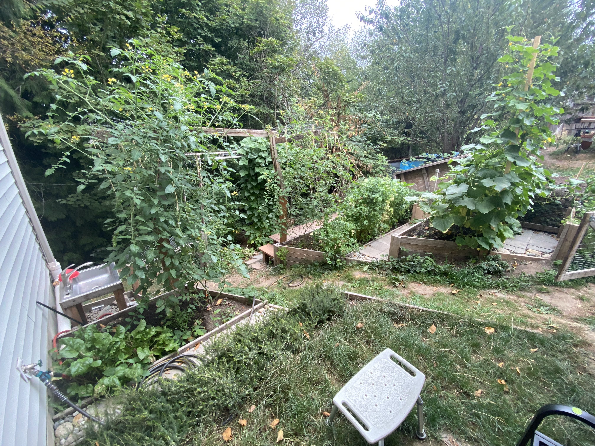
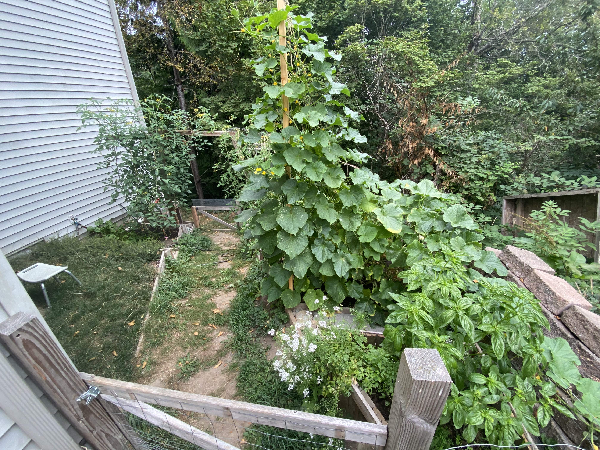
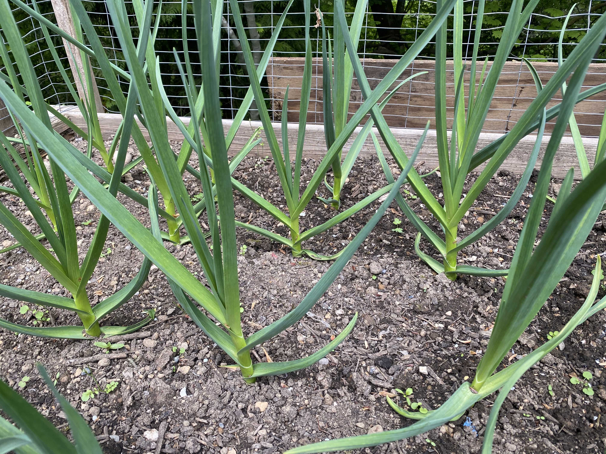

# Gardening

I have been gardening since before I could walk. I build a beautiful garden every year - mostly focused right now on providing fresh veggies for my kids and us to eat. Usually the veggies don't make it back to the kitchen!

I will provide some pictures sometime.

## Garden 2022
This was my second or third season growing two massive sun gold cherry tomato plants next to the path. 

The six-foot tall trellis on the right is cucumbers - 16 cucumber plants! And in in the furthest bed in this picture, you may be able to discern a bean pole of about 20 Blue Lake Pole Bean plants that would have happily grown twenty feet tall if I had had the trelis for them to keep going.

Another view of my 2022 garden showing the herb bed at the top and the height of the awesome cucumber trelis.

## Garden 2021
This was the first season that I grew garlic.

This image is of my crop of Inchelium Red soft stem garlic. I later stopped growing this variety and now focus only on Chesnok Red hard stem.
