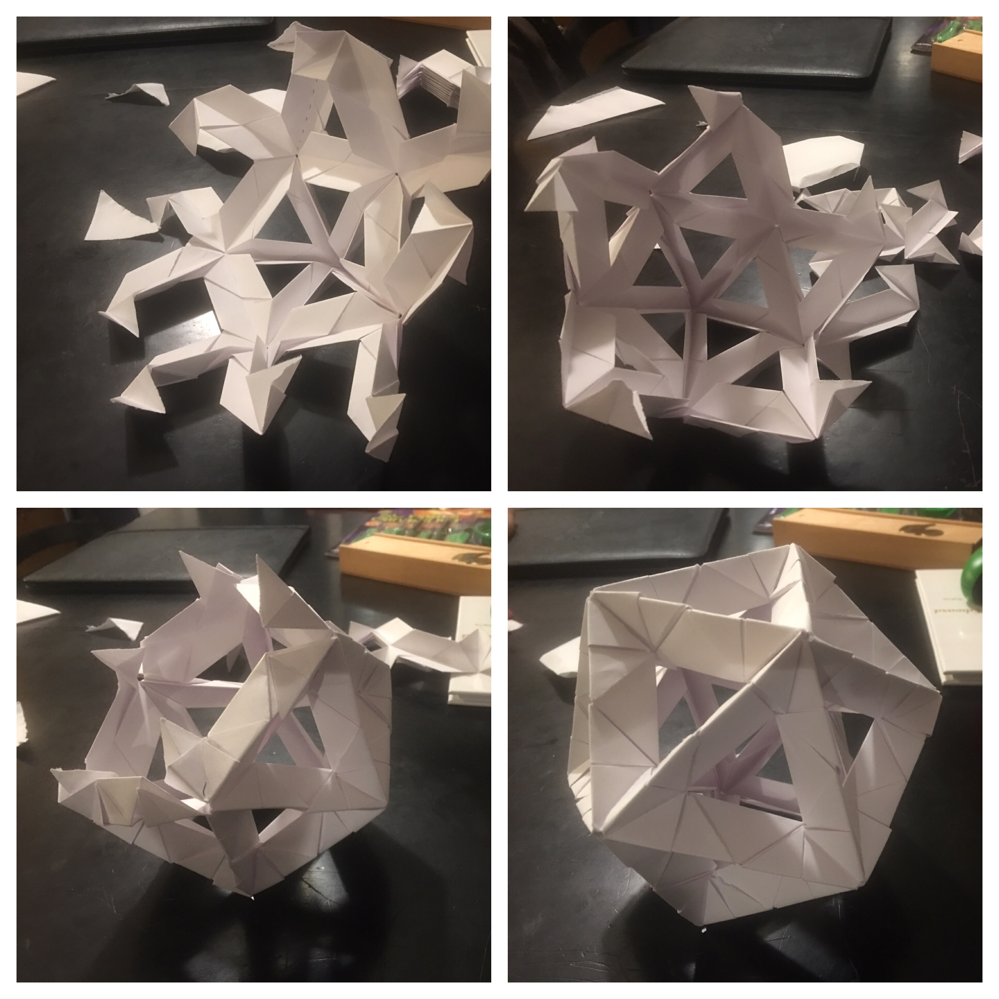
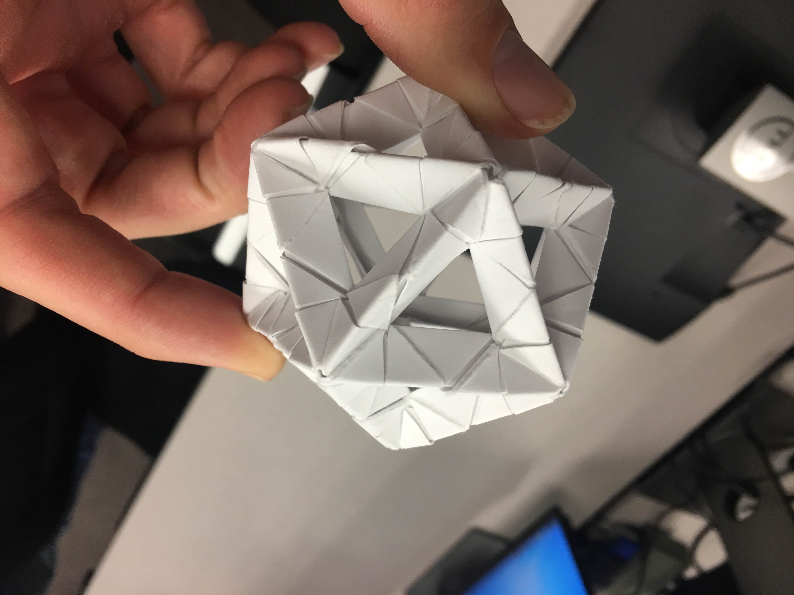
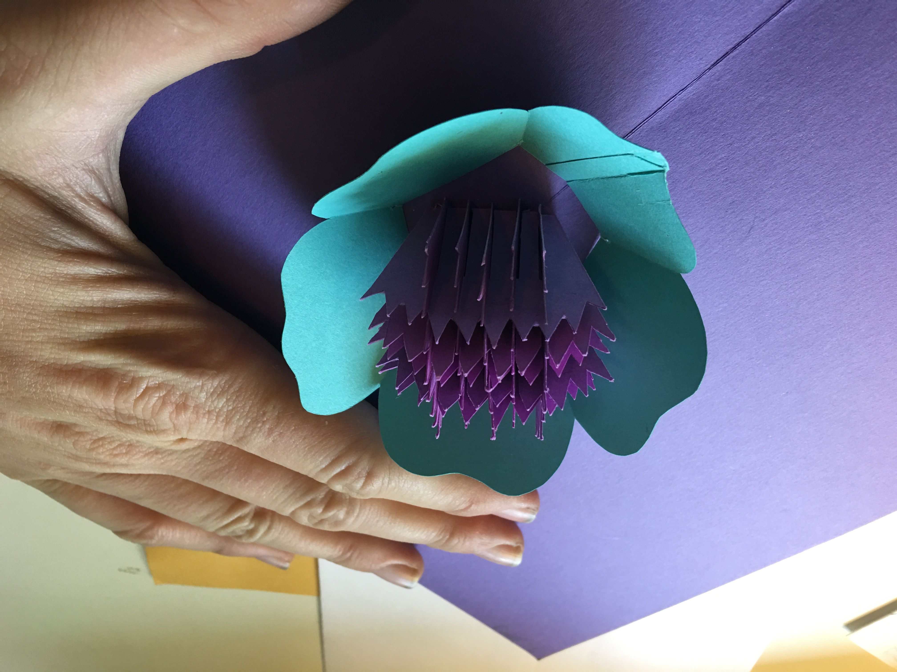

# Origami

I learned my first origami in the 4th grade when a guest taught the class how to make a T-shirt for father's day. Although I can make many animals and flowers, my real passion in origami is in popup cards and unit origami like those created by [Tomoko Fuse](https://www.amazon.com/Unit-Origami-Multidimensional-Tomoko-Fuse/dp/0870408526). Here are a few pics of both I have made in the past few years.

This is the construction of an icosahedron which has 30 edges and 20 faces. For those D&D folks, this is a D20.

Here is another icosahedron but made with squares just 2.125" across. These are challenging to make and assemble at this size but can be made with just two sheets of letter-sized paper.

This is a popup card from a book by [Masahiro Chatani](https://www.amazon.com/Paper-Magic-Pop-Up-Craft/dp/0870407570). I got the book randomly while visiting my Uncle Brian in New York when I was just 14. Popup cards like these are extra challenging to craft but so cool to give out as gifts. The paper is tied on with string that passes through and is then hidden and embellished on the other side.
